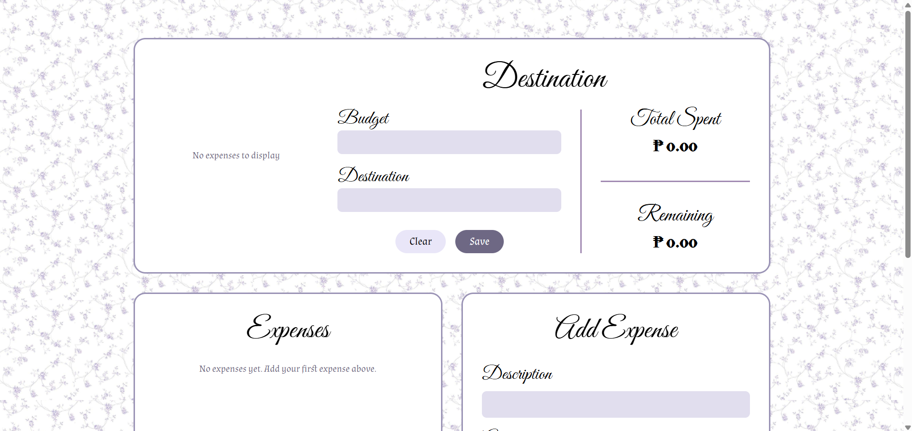

# Travel Expense Tracker

A Vue 3 single-page application for tracking travel expenses against a budget. Built with the Composition API and localStorage for data persistence.

## About This Project

This project was created during **Kiro Night – AWS User Group BuildHers+ Philippines**, where we explored Spec-Driven Development (SDD), Steering Documents, and Agent Hooks using Kiro. Additional updates have been made to enhance functionality and user experience.



## Features

- Set trip budget and destination with explicit save
- Add, edit, and delete expenses with validation
- Real-time budget tracking (total spent, remaining budget)
- Category-based pie chart visualization using Chart.js
- Automatic data persistence with localStorage
- Input validation for budget and expenses
- Start new travel to reset all data
- Responsive design for mobile and desktop

## Tech Stack

- **Vue 3.5** - Composition API with `<script setup>` syntax
- **Vite 7.3** - Fast build tooling and HMR
- **Chart.js 4.5** - Interactive pie chart visualization
- **localStorage** - Client-side data persistence (no backend required)

## Project Structure

```
travel-expense-tracker/
├── src/
│   ├── components/          # Vue components (presentational)
│   │   ├── BudgetSummary.vue    # Budget/destination inputs & summary display
│   │   ├── ExpenseForm.vue      # Add/edit expense form
│   │   ├── ExpenseList.vue      # List of expenses with actions
│   │   └── CategoryChart.vue    # Pie chart visualization
│   ├── composables/         # Business logic (singleton pattern)
│   │   ├── useBudget.js         # Budget & destination management
│   │   ├── useExpenses.js       # Expense CRUD operations
│   │   ├── useStorage.js        # localStorage abstraction
│   │   └── useValidation.js     # Input validation logic
│   ├── constants/
│   │   └── categories.js        # Expense categories list
│   ├── App.vue              # Root component
│   ├── main.js              # Application entry point
│   └── style.css            # Global styles
├── public/
│   ├── flower-bg.png        # Background image
│   └── vite.svg             # Vite logo
├── index.html               # HTML entry point
├── package.json             # Dependencies and scripts
├── vite.config.js           # Vite configuration
└── README.md                # This file
```

## Getting Started

### Prerequisites

- Node.js (v14 or higher)
- npm (comes with Node.js)

### Installation

1. Clone the repository:
```bash
git clone <your-repo-url>
cd travel-expense-tracker
```

2. Install dependencies:
```bash
npm install
```

3. Start the development server:
```bash
npm run dev
```

4. Open your browser to `http://localhost:5173`

## Usage

### Setting Up a Trip

1. Enter your **Budget** amount (must be non-negative)
2. Enter your **Destination** name
3. Click **"Save"** to save (you'll see a success message)

### Managing Expenses

1. **Add Expense**: Fill out the form with:
   - Description (required)
   - Amount (must be greater than 0)
   - Category (select from dropdown)
   - Date (defaults to today)
   - Click "Add" to save

2. **Edit Expense**: Click "Edit" on any expense, modify fields, click "Update"

3. **Delete Expense**: Click "Delete" on any expense, confirm the dialog

### Viewing Data

- **Budget Summary**: See total spent and remaining budget at the top
- **Expense List**: All expenses sorted by date (newest first)
- **Category Chart**: Pie chart showing spending breakdown by category

### Starting Fresh

Click **"Clear"** to clear all data (budget, destination, and expenses) and start tracking a new trip.

## Expense Categories

The app includes 6 predefined categories:
- Food
- Transport
- Accommodation
- Entertainment
- Shopping
- Other

## Architecture

### Design Principles

- **Composable-based architecture**: All business logic resides in composables
- **Presentational components**: Components only handle UI rendering and events
- **Singleton pattern**: Shared state across all components using module-level refs
- **Automatic persistence**: Data saves to localStorage on every change
- **Validation-first**: All inputs validated before processing

### Data Flow

1. User interacts with component
2. Component emits event to parent or calls composable function
3. Composable validates input
4. Composable updates reactive state
5. Composable saves to localStorage
6. Vue reactivity updates all dependent components

### State Management

- `useBudget`: Manages budget and destination (shared singleton)
- `useExpenses`: Manages expense array and calculations (shared singleton)
- `useStorage`: Handles localStorage serialization/deserialization
- `useValidation`: Provides validation functions

## Scripts

```bash
# Development server with hot reload
npm run dev

# Build for production
npm run build

# Preview production build locally
npm run preview
```

## Data Persistence

All data is stored in localStorage under the key `travel-expense-tracker`:

```json
{
  "tripConfig": {
    "budget": 1000,
    "destination": "Paris"
  },
  "expenses": [
    {
      "id": "uuid-here",
      "description": "Hotel",
      "amount": 250,
      "category": "Accommodation",
      "date": "2024-01-15"
    }
  ]
}
```

## Browser Compatibility

- Chrome/Edge (latest)
- Firefox (latest)
- Safari (latest)
- Any browser with ES6+ and localStorage support

## Development

Built following Vue 3 best practices:
- Composition API with `<script setup>`
- Scoped styles to prevent CSS leakage
- Semantic HTML for accessibility
- Proper form validation and error handling
- Responsive design with mobile-first approach

## License

MIT

## Author

Built with Vue 3, Vite, and Chart.js
